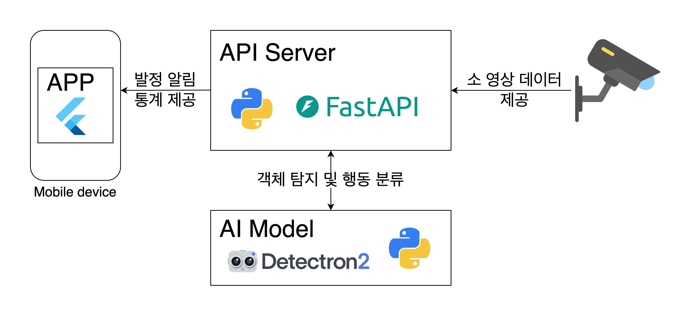

# 소 발정 탐지 API

소의 행동 데이터를 학습시킨 Detectron2 모델을 통해 소의 발정 행동을 탐지하고 시간 및 구역별 발정 빈도를 제공합니다. 이 API는 FastAPI를 사용한 RESTful API 서버이며, JWT 기반 사용자 인증 기능을 지원합니다.

## 주요 기능

- **소 발정 행동 탐지**: 이미지에서 소의 행동을 분석하여 발정 행동 여부를 탐지합니다.
- **발정 빈도 통계**: 시간대와 구역에 따른 소의 발정 빈도를 조회할 수 있는 통계 기능을 제공합니다.
- **회원 가입 및 사용자 관리**: 새로운 사용자를 등록하고, 비밀번호를 해시 처리하여 안전하게 저장합니다.
- **JWT 인증**: 로그인 후 JWT 토큰을 발급하고, 각 API 요청에 대해 토큰을 검증하여 사용자 인증을 수행합니다.

## 시스템 다이어그램



## 요구사항
- Python 3.10+
- Detectorn2
- FastAPI
- SQLAlchemy
- SQLite3
- Docker (옵션)

## 설치 및 실행 방법

1. **프로젝트 클론**

   ```bash
   git clone https://github.com/KastanEr/CowEstrusDetector.git
   cd CowEstrusDetector/ai_api
   ```  
2. **요구사항 설치**
   ```bash
   apt update
   ```
   패키지 목록을 업데이트합니다.
   ```bash
   apt install net-tools vim git python3-dev python3-venv python3-pip libgl1-mesa-glx libglib2.0-0
   ```
   필요한 시스템 패키지를 설치합니다.
   ```bash
   pip install torch torchvision opencv-python fastapi uvicorn sqlalchemy pyjwt python-multipart
   ```
   Python의 필수 라이브러리를 설치합니다.
   ```bash
   pip install 'git+https://github.com/facebookresearch/detectron2.git'
   ```
   Detectron2 모델을 설치합니다.

3. **API 실행**
   ```bash
   uvicorn main:app --reload
   ```

4. **Swagger UI 접속**  
   서버가 실행된 후 http://localhost:8000/docs에서 API 문서를 확인하고 테스트할 수 있습니다.